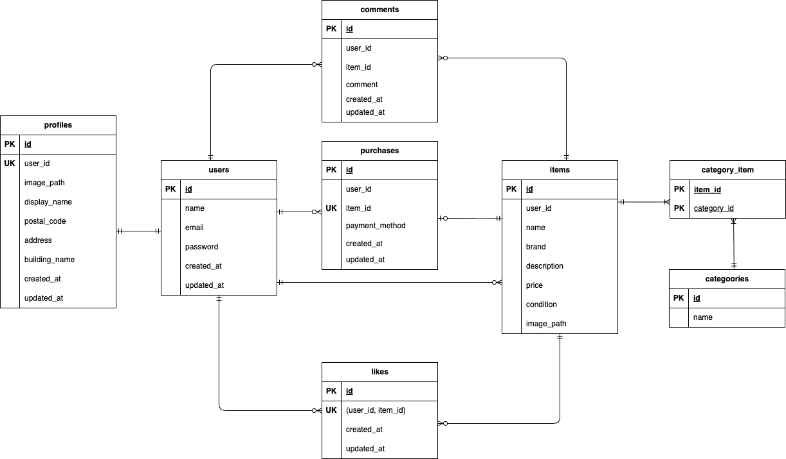

# coachtechフリマ（フリーマーケットアプリ）

## 概要
**Dockerビルド**
1. `git clone git@github.com:riichikawashima-cmd/coachtech-freemarket.git`
2. `cd coachtech-freemarket`
3. DockerDesktopアプリを立ち上げる
4. `docker-compose up -d --build`


> *MacのM1・M2チップのPCの場合、`no matching manifest for linux/arm64/v8 in the manifest list entries`のメッセージが表示されビルドができないことがあります。
エラーが発生する場合は、docker-compose.ymlファイルの「mysql」内に「platform」の項目を追加で記載してください*
``` bash
mysql:
    platform: linux/x86_64
    image: mysql:8.0.26
    environment:
```

**Laravel環境構築**
1. `docker-compose exec php bash`
2. `composer install`
3. 「.env.example」ファイルを 「.env」ファイルに命名を変更。または、新しく.envファイルを作成
4. .envに以下の環境変数を追加
``` text
DB_CONNECTION=mysql
DB_HOST=mysql
DB_PORT=3306
DB_DATABASE=laravel_db
DB_USERNAME=laravel_user
DB_PASSWORD=laravel_pass

MAIL_MAILER=smtp
MAIL_HOST=mailhog
MAIL_PORT=1025
MAIL_USERNAME=null
MAIL_PASSWORD=null
MAIL_ENCRYPTION=null
MAIL_FROM_ADDRESS=no-reply@example.com
MAIL_FROM_NAME="Coachtech Freemarket"
```
5. アプリケーションキーの作成
``` bash
php artisan key:generate
```
6. ストレージリンク作成
``` bash
php artisan storage:link
```

7. マイグレーションの実行
``` bash
php artisan migrate
```

8. シーディングの実行
``` bash
php artisan db:seed
```

※ 環境によっては「laravel.log Permission denied」エラーが発生する場合があります。その場合は以下を実行してください。
``` bash
docker-compose exec php sh -lc "chown -R www-data:www-data storage bootstrap/cache"
```

## 使用技術（実行環境）
- PHP 8.1.34
- Laravel 10.50.0
- MySQL 8.0.44
- Stripe API（Checkout）

## ER図


## URL
- アプリ：http://localhost
- phpMyAdmin：http://localhost:8080
- Mailhog（メール確認）：http://localhost:8025

## Stripe決済（テストモード）
本アプリでは「カード支払い」選択時に Stripe Checkout（テストモード）へ遷移します。
「カード支払い」を利用するには、Stripeの**テスト用シークレットキー（sk_test_...）**の設定が必要です。

① Stripeアカウントの準備

`https://dashboard.stripe.com/` にアクセスし、ログインしてください。

「テストモード」をONにする

② シークレットキーの取得

「APIキー」より「シークレットキー（sk_test_...）」をコピー

### 環境変数（.env）
追記内容
```env
STRIPE_SECRET=ここにコピーしたキーを貼り付け
```

PHPコンテナ内で以下を実行してください：
```bash
php artisan config:clear
php artisan cache:clear
```

テスト決済の入力例（Stripeテストカード）

- カード番号：4242 4242 4242 4242

- 有効期限：任意の未来日（例：12/30）

- CVC：任意（例：123）

## テストの実行方法
1. テスト用DB作成

ホスト側で以下を実行してください。
```bash
docker-compose exec mysql mysql -uroot -p -e "CREATE DATABASE demo_test;"
```

※ パスワードは docker-compose.yml に設定している MYSQL_ROOT_PASSWORD の値を入力してください。

作成確認：
```bash
docker-compose exec mysql mysql -uroot -p -e "SHOW DATABASES;"
```

demo_test が表示されればOKです。

2. .env.testing 作成

PHPコンテナ内で

```bash
cp .env .env.testing
```

3. .env.testing を以下の内容に修正

```env
APP_NAME=Laravel
APP_ENV=testing
APP_KEY=
APP_DEBUG=true
APP_URL=http://localhost

DB_CONNECTION=mysql_test
DB_HOST=mysql
DB_PORT=3306
DB_DATABASE=demo_test
DB_USERNAME=root
DB_PASSWORD=root

BROADCAST_DRIVER=log
CACHE_DRIVER=array
FILESYSTEM_DISK=public
QUEUE_CONNECTION=sync
SESSION_DRIVER=array
SESSION_LIFETIME=120

MAIL_MAILER=array
```
※ `APP_KEY` は空のままでOKです。（次の `key:generate` 実行で自動生成されます）

※ 本アプリでは config/database.php に mysql_test 接続を追加しています。

4. テスト用アプリケーションキー生成

```bash
php artisan key:generate --env=testing
```

5. テスト用マイグレーション実行
```bash
php artisan migrate --env=testing
```

6. テスト実行方法

PHPコンテナ内で以下を実行

```bash
php artisan test --testdox
```

特定のテストのみ実行したい場合：

```bash
php artisan test tests/Feature/ItemIndexTest.php --testdox
```

### テストファイル一覧の確認方法

PHPコンテナ内で以下を実行してください。

```bash
ls tests/Feature
```

## 補足（コーチ確認事項）
 ※ 機能要件に詳細な記載がない場合は、本実装で問題ない旨コーチより許可をいただいています。

1. **購入完了後の画面遷移**
   購入ボタン押下後は、商品一覧画面へ遷移する実装としています。

2. **エラーメッセージの表示**
   エラーメッセージは赤文字で統一し、表示しています。

3. **ロゴ押下時の遷移**
   ロゴをクリックすると商品一覧画面へ戻る仕様としています。

4. **コメント表示件数**
   最新のコメント5件までを表示し、それ以前のコメントはタブ操作で閲覧できる仕様としています。

5. **Sold表示のデザイン**
   Sold表示は「黒背景・白文字」で商品画像左上に表示しています。

6. **売却済み商品の閲覧範囲**
   Sold outした商品については、
   - 商品詳細：閲覧可
   - いいね：可
   - コメント：可
   - 購入手続き：不可（ボタン押下しても遷移しない）
   としています。

7. **出品画面での商品画像の再選択**
   出品時に商品画像を選び直せる仕様としています。

8. **販売価格入力欄の表示**
   販売価格入力後も「￥」マークが表示されたままになる仕様としています。

9. **出品時のカテゴリ**
   出品時のカテゴリは、ユーザーが自由に追加できない仕様としています。

10. **出品確認画面の遷移**
    出品ボタン押下後は出品確認画面へ遷移し、
    確認画面でOKボタン押下後に商品一覧画面へ戻る仕様としています。

11. **出品商品が存在しない場合の表示**
    出品した商品が存在しない場合は
    「出品した商品がありません」という文言を表示しています。

12. **プロフィール画像のトリミング**
    プロフィール画像は、使用する範囲をユーザーが選択できる仕様としています。

13. **配送先変更時の住所反映**
    商品購入時に配送先を変更しても、
    マイページの住所は変更されない仕様としています。

14. **支払い方法未選択時の表示**
    商品購入画面で支払い方法が未選択の場合は
    画面右側の「支払い方法」が「選択してください」と表示される仕様としています。

15. **出品商品の削除機能**
    出品した商品の削除機能は実装していません。

16. **郵便番号のバリデーション**
    機能要件に記載がないため、郵便番号のバリデーションは実装していません。

17. **メールアドレスの重複登録**
    同じメールアドレスは使用できない仕様としています。
    エラーメッセージは
    「このメールアドレスは既に使用されています。」と表示します。